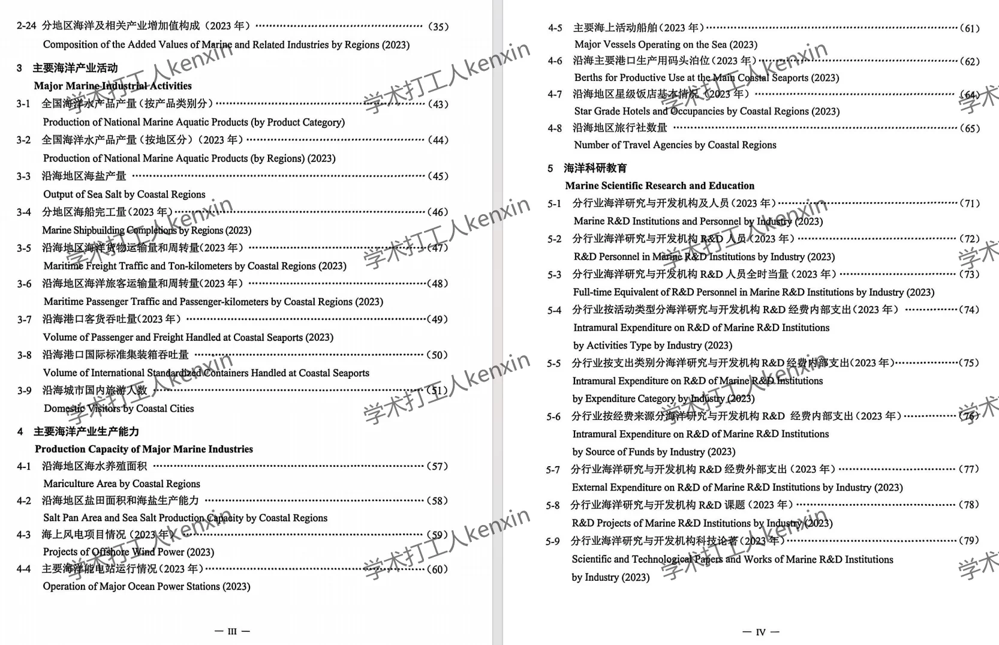
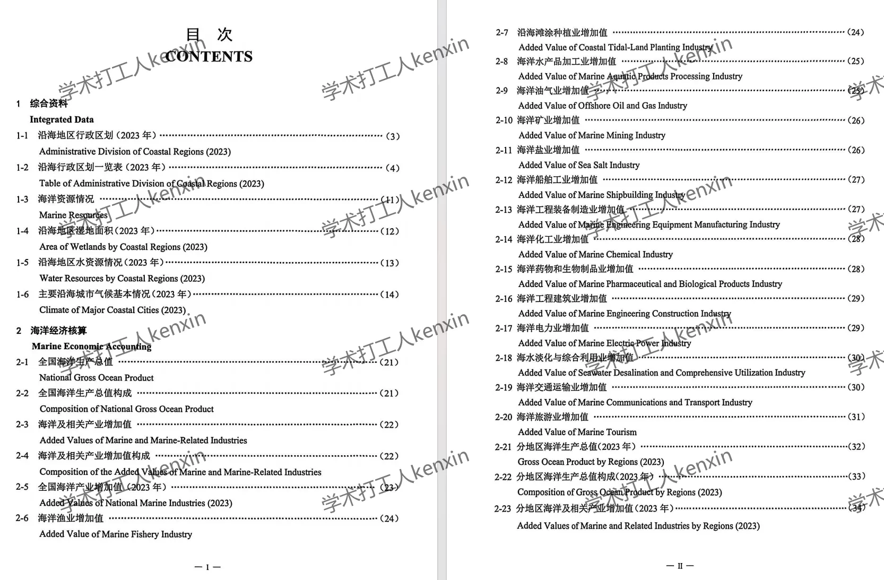
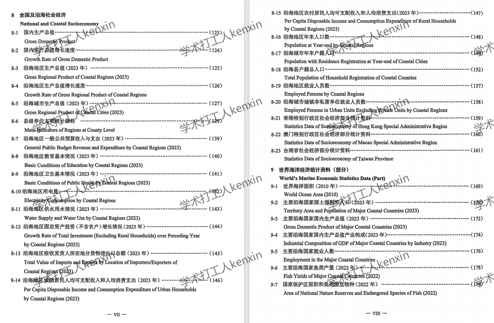
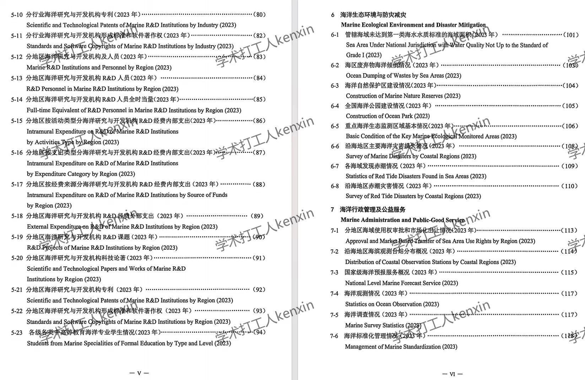
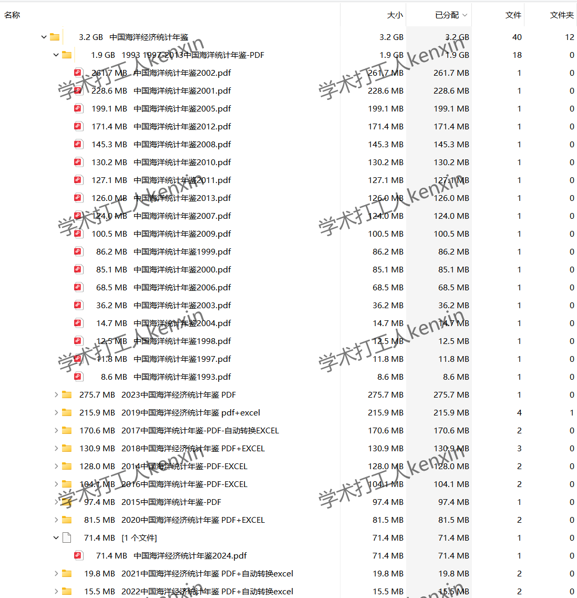
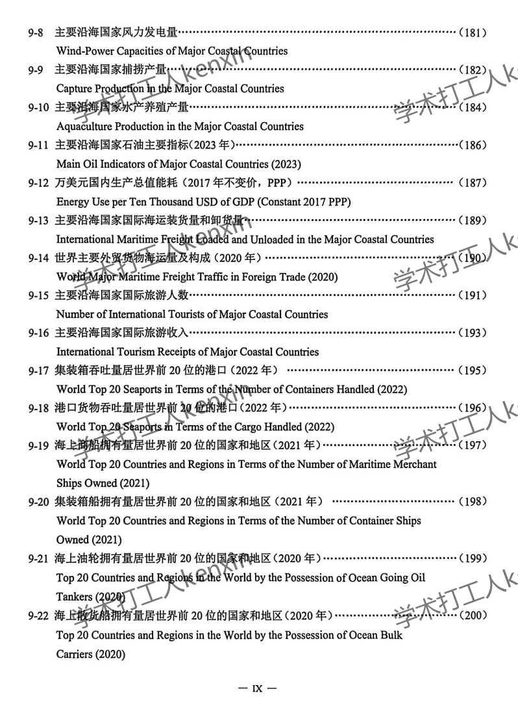

## Body

《China Marine Economy Statistical Yearbook》（1993-2024）

Data Year: The yearbook covers the years from 1993 to 2024, with data recorded for the previous year.
All entries are raw yearbooks, not panel data compiled neatly! Please be clear before purchasing and understand that after purchase, there will be no returns or exchanges.

01. Data Introduction
The China Marine Economy Statistical Yearbook

02. Indicator Details
The directory is displayed in the picture for reference. Due to the limited space of the picture, it cannot display all indicators. The actual content of the yearbook should be considered. Please view it on your own and make a purchase accordingly. If you need help finding specific data, please let me know, as I am here to assist. After shipment, we do not support unreasonable returns.
The display directory is for 2024, for reference only. Different statistical methods may change over time. For academic purposes, please note this.

03. Data Format
Format: Excel or PDF, as shown in the picture. Please read carefully before purchasing.

## Images

item_1073311405804

Here is a pay link on Stripe ( https://buy.stripe.com/3cs8yP7sY87d0vu9AB ). Please contact me lonlonago@foxmail.com after funding $89, and I will send you a complete data files , thank you!

